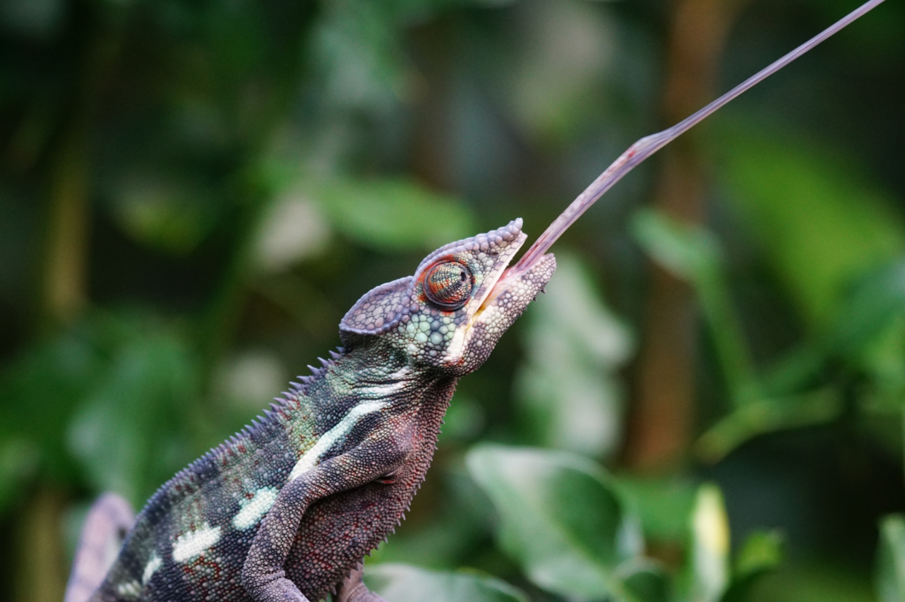

<!DOCTYPE html>
<html lang="en">
<head>
  <meta charset="UTF-8">
  <meta name="viewport" content="width=device-width, initial-scale=1.0">
  <title>Blog — SciComm Initiative</title>
  <meta name="description" content="Science stories told by the people doing the science — and those who love to write about it.">
  <link rel="stylesheet" href="style.css">
</head>
<body>

<nav>
  <a href="../../index.html" class="nav-logo">SciComm Initiative</a>
  <ul class="nav-links">
    <li><a href="../../blog.html" class="active">Blog</a></li>
    <li><a href="../../podcast.html">Podcast</a></li>
    <li><a href="../../workshops.html">Workshops</a></li>
    <li><a href="../../cafe.html">Science Café</a></li>
    <li><a href="../../about.html">About</a></li>
  </ul>
  <a href="../../cafe.html#rsvp" class="nav-join">Join us</a>
</nav>

# Nature's Inspiration: Power Amplification

## Introduction

Whether jumping or striking, or launching a seed for dispersal, many organisms utilize energy storage and release to generate rapid movements. In animals, there is a limit to how much power muscle can generate alone, but with the help of elastic tissues, like tendons, animals can store energy to release extremely rapidly (think of a bow and arrow). This build up and rapid release of energy to generate output far greater than what muscle can achieve alone is known as *power amplification*.

## The Biology

Power amplification in nature is widespread, with animals as diverse as fleas and chameleons generating extreme power. Many insects, like the common flea, achieve significant speeds for locomotion by using their muscles to load elastic tissues in their legs with potential energy, and releasing it like a spring during a jump. This explosive release of potential energy allows them to jump magnitudes further than they could with muscle alone, making them excellent escape artists in the presence of a predator.

Similarly, chameleons contract specialized muscles in their mouth and throat to compress and load elastic tissues like a spring. Upon release, the stored potential energy launches the tongue forward toward unsuspecting prey.

Beyond internal power amplification, researchers have also discovered external power amplification in a species of spider that builds a web "catapult" to catch prey. The spider first pulls the web taut toward an anchor surface, loading potential energy into the web's silk threads. When released, both the spider and web catapult in its prey.

Some plant systems also utilize power amplification, often for seed dispersal. While no muscles are involved, plants can load potential energy into their tissues during growth. For example, elastic potential energy stored in the tissues of fruit pods can be released upon drying, launching seeds far away from the parent plant. One unique plant, the squirting cucumber, generates high internal pressure inside the fruit until it bursts and shoots a seed-ridden liquid away from the plant.

## Driving Innovation

Power amplification allows natural systems to leverage potential energy to generate high acceleration for locomotion, predation, and even reproduction. The mechanisms that underlie this phenomenon bypass the constraints of natural muscle and other biological materials. Understanding and mimicking the biomechanical principles that allow natural systems to amplify power may hold valuable insight for engineering design of propulsion systems or novel dispersal mechanisms.
